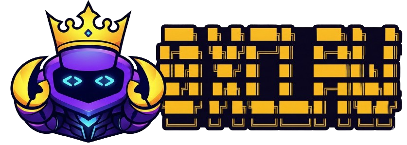
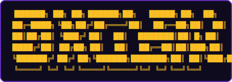

# 🦀 0xClaw — Autonomous AI Hackathon Competitor

<div align="center">



<br />

<!-- 

<br /> -->

<br />

[](https://python.org)
[](./LICENSE)
[](https://flock.io)
[](http://z.ai)

</div>

---

## ⚙️ Setup

```bash
conda create -n 0xclaw python=3.11 -y
conda activate 0xclaw
pip install -e .
cp .env.example .env
./scripts/verify_setup.sh
```

Then fill in `FLOCK_API_KEY` in `.env`.

For a quick sanity check after installation:

```bash
python launcher/__main__.py --help
0xclaw --help
```

`pip install -e .` installs both the runtime dependencies and the local CLI in editable mode.
If you also want development tooling such as Ruff, use `pip install -e .[dev]`.
`requirements.txt` is kept as a compatibility mirror of the same runtime dependency set.

## 🚀 Launch

```bash
conda activate 0xclaw
0xclaw           # interactive CLI
0xclaw --logs    # with debug output
0xclaw gateway   # start Telegram/other chat channels from repo config
0xclaw whatsapp login   # start WhatsApp bridge and scan QR
```

`0xclaw` is the canonical runtime entrypoint.
`./scripts/start.sh` is an optional convenience wrapper that activates conda, loads `.env`, then runs `0xclaw`.
`./scripts/verify_setup.sh` is a preflight checker.

Legacy scripts:
- `scripts/run_phase.py`: single-phase engineering/debug runner.
- `scripts/hackathon_runner.py`: deprecated compatibility path; avoid for normal workflow.

Integration docs:
- Claude Code coding backend: `docs/integrations/claude-code-subagent.md`.
- Docs index: `docs/README.md`.


## 🔄 Pipeline

The agent runs a 7-phase pipeline to produce a complete hackathon submission.
Trigger any phase with natural language — routing is automatic.

<div align="center">
<table>
<tr><th>#</th><th>Phase</th><th>Output</th></tr>
<tr><td>1</td><td><b>research</b></td><td><code>hackathon/context.json</code></td></tr>
<tr><td>2</td><td><b>idea</b></td><td><code>hackathon/ideas.json</code></td></tr>
<tr><td>3</td><td><b>selection</b></td><td><code>hackathon/selected_idea.json</code></td></tr>
<tr><td>4</td><td><b>planning</b></td><td><code>hackathon/plan.md</code> · <code>hackathon/tasks.json</code></td></tr>
<tr><td>5</td><td><b>coding</b></td><td><code>hackathon/project/</code></td></tr>
<tr><td>6</td><td><b>testing</b></td><td><code>hackathon/test_results.json</code></td></tr>
<tr><td>7</td><td><b>doc</b></td><td><code>hackathon/submission/</code></td></tr>
</table>
</div>

```
Some prompts for quick understand the processe:

research the hackathon requirements
generate project ideas
plan the architecture
implement the project
run tests
write the documentation
```

## ⌨️ Commands

<div align="center">
<table>
<tr><td><code>/status</code></td><td>Pipeline progress + session token usage</td></tr>
<tr><td><code>/resume</code></td><td>Resume from last checkpoint</td></tr>
<tr><td><code>/redo &lt;phase&gt;</code></td><td>Reset phase and all downstream, then re-run</td></tr>
<tr><td><code>/new</code></td><td>Clear all outputs, fresh start</td></tr>
<tr><td><code>/stop</code></td><td>Cancel running task</td></tr>
<tr><td><code>/help</code></td><td>Show all commands</td></tr>
<tr><td><code>?</code></td><td>Alias for /help</td></tr>
<tr><td><code>!&lt;cmd&gt;</code></td><td>Run a shell command without leaving the agent (e.g. <code>!git status</code>)</td></tr>
</table>
</div>

Long-running phases hand off to the background after the first reply — you can keep chatting while work continues.
**Ctrl+C** interrupts the current task but never exits — type `/exit` to quit.

---

## 🧠 Models

Inference powered by **FLock.io** and **Z.AI**

<div align="center">
<table>
<tr><th>Phases</th><th>Model</th><th>Context</th></tr>
<tr><td>research · idea · selection · doc</td><td><code>minimax-m2.1</code></td><td>196k</td></tr>
<tr><td>planning · coding · testing</td><td><code>minimax-m2.5</code></td><td>205k</td></tr>
</table>
</div>

Per-phase timeout and fallback behavior are defined in `0xclaw/config/model_profiles.json` (source of truth).

## 💬 Channels

The runtime has built-in support for 10 messaging platforms (2/10 now passed solid test). Enable any via `config.json` + one env var:

<div align="center">
<table>
<tr><td>$\color{#25D366}{\textbf{Telegram}}$</td><td><b>Discord</b></td><td><b>Slack</b></td><td><b>Email</b></td><td><b>Feishu</b></td></tr>
<tr><td><b>DingTalk</b></td><td><b>Matrix</b></td><td><b>WeChat Work</b></td><td><b>QQ</b></td><td>$\color{#25D366}{\textbf{WhatsApp}}$</td></tr>
</table>
</div>

Telegram uses long polling — no public IP or webhook required.
Configure it in `0xclaw/config/config.json` under `channels.telegram`, then run `0xclaw gateway`.

WhatsApp uses a local bridge process. Configure `channels.whatsapp`, run `0xclaw whatsapp login` to scan the QR code, then start `0xclaw gateway`. Bridge assets and auth state are stored under `~/.0xclaw/`.

---

<div align="center">


</div>

<div align="center">
<sub>Built in collaboration with 🦞 <a href="https://github.com/openclaw/openclaw">OpenClaw</a>  · Thanks to 🐈 <a href="https://github.com/HKUDS/nanobot">NanoBot</a> Framework</sub>
</div>
